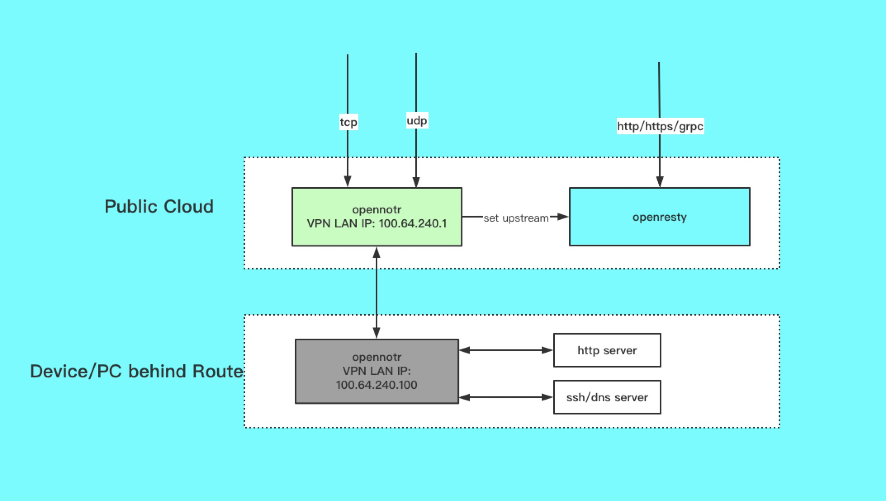

<p align="center">
  
</p>


<p align="center">
  <a href="https://goreportcard.com/report/github.com/ICKelin/opennotr" rel="nofollow">
    
  </a>

  <a href="https://travis-ci.org/ICKelin/opennotr" rel="nofollow">
    
  </a>
  <a href="https://github.com/ICKelin/opennotr/blob/master/LICENSE">
    
  </a>
</p>

[English](README_EN.md) | 简体中文

## 介绍

opennotr是一款开源的内网穿透软件，opennotr基于VPN技术构建虚拟局域网，虚拟局域网网关通过虚拟局域网IP可以访问到客户端，进而实现内网穿透。

opennotr支持多种协议，包括http，https，grpc，tcp，udp，为了实现http，https，grpc协议端口复用，opennotr引入了openresty作为网关，从而多个客户端不同域名可以共享http的80，https的443端口，不需要额外的端口。

opennotr支持定制化插件，我们内置了http, https, grpc, tcp, udp代理，可以覆盖大部分场景，同时，opennotr允许自己开发协议插件，比如说，如果您希望使用apisix来作为前置的网关，您可以开发opennotr的apisix插件，opennotr会把一些基本信息传递给插件，其余功能均由插件自己进行。

事实上，opennotr支持的几种协议也是以插件的形式存在的，只是默认导入到程序当中。

**Status: 开发中**

## 目录
- [介绍](#介绍)
- [opennotr的技术原理](#opennotr的技术原理)
- [如何开始使用](#如何开始使用)
    - [安装opennotrd](#安装opennotrd)
    - [运行opennotr](#运行opennotr)
    - [相关文章与视频]()
- [插件开发](#插件开发)
- [有问题怎么办](#有问题怎么办)
- [关于作者](#关于作者)

## opennotr的技术原理



最下层是客户端所在的机器/设备，同时也作为虚拟局域网当中的一台机器，具备该局域网的IP地址`100.64.240.100`

最上层是服务端所在的机器，同时也作为虚拟局域网当中的网关，具备该局域网的IP地址`100.64.240.1`，opennotr提供能够在`Public Cloud`层可通过`100.64.240.100`访问`Device/PC behind Routed`的能力。在这个能力的基础之上构建整个内网穿透体系,。

为了实现http，引入了openresty作为反向代理服务器(其实最初是使用的nginx reload)，upstream的地址是`100.64.240.100`，从openresty的层面来看，并不关注内网地址和外网地址，只要能通就行，从上面我们知道opennotr底层就是构建一个VPN隧道，因此能通。

针对tcp和udp，opennotr倒是没有使用openresty的功能，而是自己开发的代理程序，当前也是集成在opennotrd程序当中，具体可参考以下两个文件。

- [tcpproxy.go](https://github.com/ICKelin/opennotr/blob/master/opennotrd/tcpproxy.go)
- [udpproxy.go](https://github.com/ICKelin/opennotr/blob/master/opennotrd/udpproxy.go)

不使用openresty处理tcp和udp主要基于以下考虑：

- openresty本身的stream功能并不能满足要求，这里的场景是事先不知道需要监听哪个端口，而openresty的server配置块需要预先知道监听的端口，否则需要重写配置再reload。

- openresty的stream模块和http是分割的，原本使用http接口实现的动态upstream针对tcp并不生效，因此需要使用lua的tcp编程接受请求，作者自身对lua和openresty了解不深，不贸贸然行动。

- 不使用openresty构建tcp/udp代理难度并不大，http使用openresty是为了端口复用，根据host区分，而tcp则没有类似的机制，也就是说，即使用openresty，也是单独的端口。

后续有兴趣的同学可以考虑将openresty完全换成golang实现，或者将golang的tcp/udp部分换成openresty。笔者注意到市面上已经有类似的实现，比如[apache apisix](https://github.com/apache/apisix)是使用的openresty实现的http,tcp,udp网关，这个是很不错的项目，我的[resty-upstream](https://github.com/ICKelin/resty-upstream)项目大部分都是从该项目学习而来

[返回目录](#目录)

## 如何使用

opennotr包括服务端程序`opennotrd`和客户端程序`opennotr`

### 安装opennotrd

**强烈建议使用docker运行opennotrd**

为了运行opennotrd，您需要准备好程序运行的配置文件和tls证书等信息，以下为笔者的一个示例

```
root@iZwz97kfjnf78copv1ae65Z:/opt/data/opennotrd# tree
.
|-- cert ---------------------> 证书，秘钥目录
|   |-- upstream.crt
|   `-- upstream.key
`-- notrd.yaml ---------------> opennotrd启动的配置文件

2 directories, 5 files
```

这里主要关注`notrd.yaml`文件的内容，该文件是opennotrd运行时的配置文件.

```
root@iZwz97kfjnf78copv1ae65Z:/opt/data/opennotrd# cat notrd.yaml
server:
  # server监听的tcp地址
  listen: ":10100"
  # 认证key，每个客户端都需要配置该key
  authKey: "client server exchange key"
  # 使用的域名，如果有动态域名解析，会生成改域名的子域名
  domain: "open.notr.tech"

# VPN虚拟局域网IP网段信息
dhcp:
  cidr: "100.64.242.1/24"
  ip: "100.64.242.1"

# openresty 动态upstream管理接口，通常不需要改变。
upstream:
  remoteAddr: "http://127.0.0.1:81/upstreams"
```

准备好配置之后运行以下命令即可开始启动:

`docker run --privileged --net=host -v /opt/logs/opennotr:/opt/resty-upstream/logs -v /opt/data/opennotrd:/opt/conf -d opennotrd`

需要配置volume，将主机目录`/opt/data/opennotrd`挂载到容器的`/opt/conf`当中，`/opt/data/opennotrd`为在上一步当中创建的配置文件，证书目录。

或者您也可以使用docker-compose启动

```
wget https://github.com/ICKelin/opennotr/blob/develop/docker-build/docker-compose.yaml

docker-compose up -d opennotrd
```

如果您通过ifconfig命令可以看到tunX之类的网卡，那么说明启动成功了

> 注意:
> 有的服务器没有将iptables的forward默认设置为ACCEPT，会导致失败，需要使用以下命令将其设置为ACCEPT
> iptables -t filter -P FORWARD ACCEPT

### 运行opennotr
opennotr的启动比较简单，首先需要准备配置.

```
pi@raspberrypi:~ $ cat /opt/opennotr/config.yaml
# opennotrd的公网ip和端口
serverAddr: "demo.notr.tech:10100"

# opennotrd服务启动时配置文件的authKey字段
key: "client server exchange key"

# 使用的域名
domain: "cloud.dahuizong.com"

# http端口信息
http: 8080
https: 8080
grpc: 50052

# tcp端口信息
# 外网端口: 本机监听端口
tcp:
  2222: 22
```

配置准备好之后，启动opennotr即可

`./opennotr -conf config.yaml`


[返回目录](#目录)

### 相关文章和视频

- [opennotr基本用法](https://www.zhihu.com/zvideo/1348958178885963776)
- [opennotr进阶-使用域名](https://www.zhihu.com/zvideo/1357007720181293056)

## 有问题怎么办

- [查看文档](https://github.com/ICKelin/opennotr/tree/develop/doc)
- [提交issue](https://github.com/ICKelin/opennotr/issues)
- [查看源码](https://github.com/ICKelin/opennotr)
- [联系作者交流解决](#关于作者)


[返回目录](#目录)

## 插件开发
要开发opennotr支持的插件，您需要实现以下接口:

```golang
// Proxier defines stream proxy API
type Proxier interface {
	Setup(json.RawMessage) error
	StopProxy(item *ProxyItem)
	RunProxy(item *ProxyItem) error
}


type ProxyItem struct {
	Protocol      string
	From          string
	To            string
	Domain        string
	Ctx           interface{} // data pass to proxier
	RecycleSignal chan struct{}
}

```

`Setup`函数负责初始化您的插件，由插件管理程序调用，开发者无需手动调用，参数是插件运行需要的配置，格式为`json`格式

`RunProxy`和`StopProxy`也是由我们插件管理程序调用的，需要由开发者自己实现。

实现以上三个接口之后，需要在程序当中导入您的插件所在的包，比如我们支持的三个插件

```golang
import (
	// plugin import to register
	_ "github.com/ICKelin/opennotr/opennotrd/plugin/restyproxy"
	_ "github.com/ICKelin/opennotr/opennotrd/plugin/tcpproxy"
	_ "github.com/ICKelin/opennotr/opennotrd/plugin/udpproxy"
)
```

[返回目录](#目录)

## 关于作者
一个爱好编程的人，网名叫ICKelin。对于以下任何问题，包括

- 项目实现细节
- 项目使用问题
- 项目建议，代码问题
- 案例分享
- 技术交流

可加微信: zyj995139094