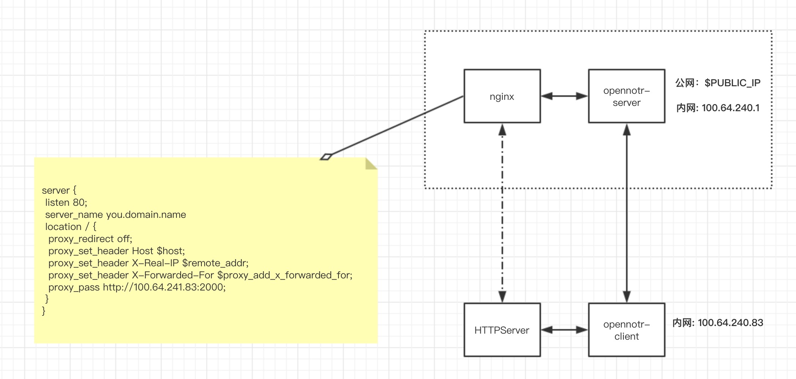

## opennotr
opennotr是[notr](http://www.notr.tech)的开源版本，是Notr的最初版本，思路来源于我个人另外一个开源项目[gtun](https://github.com/ICKelin/gtun)，提供http和https内网穿透功能。Notr软件在考虑大量引入etcd，这一老版本兼容成本过高，所以将其源代码开放。

### 定位
相比与notr而言，opennotr只保留最原生态的内网穿透功能，opennotr的是开源项目。opennotr会对notr的以下功能进行削减：

- registry, registry是notr pro非常核心的组件，可以说是最核心的组件之一，但是最主要的目的是负载均衡以及尽可能的让用户少配置，加入到opennotr当中会涉及更多的交互代码，会让代码阅读人员抓不到重点。

- 用户中心，用户中心主要是用户相关的配置，包括用户名，授权码，限速，域名配置等，自身也是涉及非常多业务，不是一个我心中认为的opensource项目应该做的事。

- dns, dns也是notr最核心的组件之一，支撑所有与域名相关的配置，部分代码抽取成[notrn](https://github.com/ICKelin/notrns)，后期改成coredns+etcd结合，这个dns项目基本上算是放弃了，感兴趣可以去了解[coredns](https://github.com/coredns/coredns)和[etcd](https://github.com/etcd-io/etcd)这两个项目

### 核心思路
opennotr的核心是VPN+Nginx，opennotr-client和opennotr-server组成一个内网，在这个内网的基础之上，opennotr-server所在的机器上任何应用程序都可以通过内网IP访问opennotr-client。Nginx也是位于opennotr-server服务器上的一个应用程序，最直观的感受就是nginx反向代理到内网的httpserver（大家都知道这是不可能的事）



## 配置

opennotr-server配置:
```

{
    "device_ip": "100.64.241.1",
    "listen": ":9641",
    "tap": false,
    "client":[
        {
            "auth_key": "client authorize key",
            "domain": "192.168.31.2"
        }
    ]
}
```

opennotr-client没有配置，采用命令行参数的方式

```
➜  notr ./notr -h
./notr [OPTIONS]
Options:

  -auth string
    	authorize token
  -http int
    	local http server port
  -https int
    	local https server port
  -srv string
    	server address
  -tcp string
    	local tcp port list, seperate by ","
  -v	print version

example:
   ./notr -http 8000 -s 127.0.0.1:9409
   ./notr -https 443 -s 127.0.0.1:9409
   ./notr -tcp 22,25 -s 127.0.0.1:9409
   ./notr -http 8000 -https 443 -tcp 22,25 -s 127.0.0.1:9409
   ./notr -https 443 -auth "YOUR AUTH TOKEN" -s 127.0.0.1:9409

```

## Thanks
[songgao/water](https://github.com/songgao/water)

## 最后
如果对notr感兴趣，可以关注notr的开发计划。