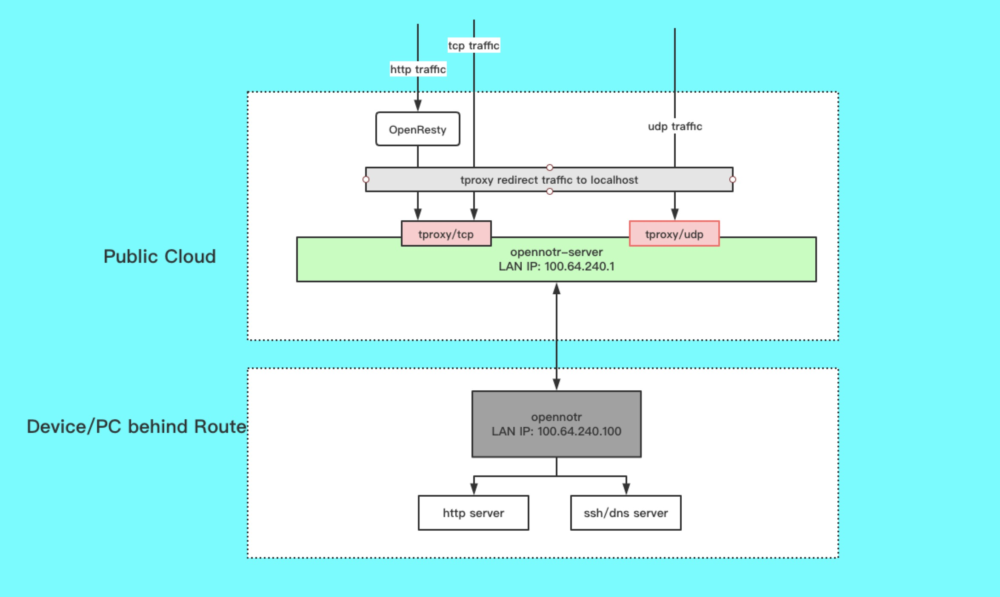

## opennotr
[](https://travis-ci.org/ICKelin/opennotr)
[](https://goreportcard.com/report/github.com/ICKelin/opennotr)

opennotr is a nat tranversal application base on `tproxy` and openresty.

opennotr provides http, https, grpc, tcp and udp nat traversal. For http, https, grpc, opennotr supports multi client share the 80/443 ports, it maybe useful for wechat, facebook webhook debug.

**Status: Work in progress**

The technical architecture of opennotr



Table of Contents
=================
- [Features](#Features)
- [Build](#build)
- [Install](#Install)
- [Plugin](#Plugin)
- [Technology details](#Technology-details)
- [Author](#Author)

Features
=========
opennotr provides these features:

- Supports multi protocol, http, https, grpc, tcp, udp.
- Multi client shares the same http, https, grpc port, for example: client A use `a.notr.tech` domain, client B use `b.notr.tech`, they can both use 80 port for http. Opennotr use openresty for dynamic upstream.
- Dynamic dns support, opennotr use coredns and etcd for dynamic dns.
- Support plugin

[Back to TOC](#table-of-contents)

Build
=====

**Build binary:**

`./build_exec.sh`

The binary file will created in bin folder.

**Build docker image:**

`./build_image.sh`

This scripts will run `build_exec.sh` and build an image name `opennotr`

[Back to TOC](#table-of-contents)

Install
=========

**Install via docker-compose**

1. create configuration file

`mkdir /opt/data/opennotrd`

An example of configuration folder tree is:

```
root@iZwz97kfjnf78copv1ae65Z:/opt/data/opennotrd# tree
.
|-- cert ---------------------> cert folder
|   |-- upstream.crt
|   `-- upstream.key
`-- notrd.yaml ---------------> opennotr config file

2 directories, 5 files
```

the cert folder MUST be created and the crt and key file MUST created too.

```yml
server:
  listen: ":10100"
  authKey: "client server exchange key"
  domain: "open.notr.tech"
  tcplisten: ":4398"
  udplisten: ":4399"

dhcp:
  cidr: "100.64.242.1/24"
  ip: "100.64.242.1"

plugin:
  tcp: |
    {
      "PortMin": 10000,
      "PortMax": 20000
    }

  udp: |
    {
      "PortMin": 20000,
      "PortMax": 30000
    }

  http: |
    {
      "adminUrl": "http://127.0.0.1:81/upstreams"
    }

  https: |
    {
      "adminUrl": "http://127.0.0.1:81/upstreams"
    }

  h2c: |
    {
      "adminUrl": "http://127.0.0.1:81/upstreams"
    }
```

the only one configuration item you should change is `domain: "open.notr.tech"`, replace `open.notr.tech` with your own domain.

2. Run with docker

`docker run --privileged --net=host -v /opt/logs/opennotr:/opt/resty-upstream/logs -v /opt/data/opennotrd:/opt/conf -d opennotr`

Or use docker-compose


```
wget https://github.com/ICKelin/opennotr/blob/develop/docker-build/docker-compose.yaml

docker-compose up -d opennotrd
```

**Run opennotr client**

prepare config file`config.yaml`
```yaml
serverAddr: "demo.notr.tech:10100"
key: "client server exchange key"
domain: "cloud.dahuizong.com"

# forward table
forwards:
  - protocol: tcp
    ports:
      # public port: local port
      2222: 2222
  
  - protocol: udp
    ports:
      53: 53
  
  - protocol: http
    ports:
      0: 8080
  
  - protocol: https
    ports:
      0: 8081
  
  - protocol: h2c
    ports:
      0: 50052
      
```

and then you can run the opennotr client using `./opennotr -conf config.yaml` command

[Back to TOC](#table-of-contents)

Plugin
=======
opennotr provide plugin interface for developer, Yes, tcp and udp are buildin plugins. 

For a new plugin, you should implement the IPlugin interface which contains RunProxy method.

```golang
// IPlugin defines plugin interface
// Plugin should implements the IPlugin
type IPlugin interface {
	// Setup calls at the begin of plugin system initialize
	// plugin system will pass the raw message to plugin's Setup function
	Setup(json.RawMessage) error

	// Close a proxy, it may be called by client's connection close
	StopProxy(item *PluginMeta)

	// Run a proxy, it may be called by client's connection established
	RunProxy(item *PluginMeta) error
}
```

And then implement the interface

```golang
package tcpproxy

import (
	"encoding/json"
	"fmt"

	"github.com/ICKelin/opennotr/opennotrd/plugin"
)

func init() {
	plugin.Register("tcp", &TCPProxy{})
}

type TCPProxy struct{}

func (t *TCPProxy) Setup(config json.RawMessage) error { return nil }

func (t *TCPProxy) StopProxy(item *plugin.PluginMeta) {}

func (t *TCPProxy) RunProxy(item *plugin.PluginMeta) error {
	return fmt.Errorf("TODO://")
}
```

and then import the plugin package
```golang
import (
	// plugin import
	_ "github.com/ICKelin/opennotr/opennotrd/plugin/tcpproxy"
)
```

Technology details
==================

- [opennotr architecture]()
- [opennotr dynamic upstream implement]()
- [opennotr vpn implement]()

[Back to TOC](#table-of-contents)

Author
======
A programer name ICKelin.